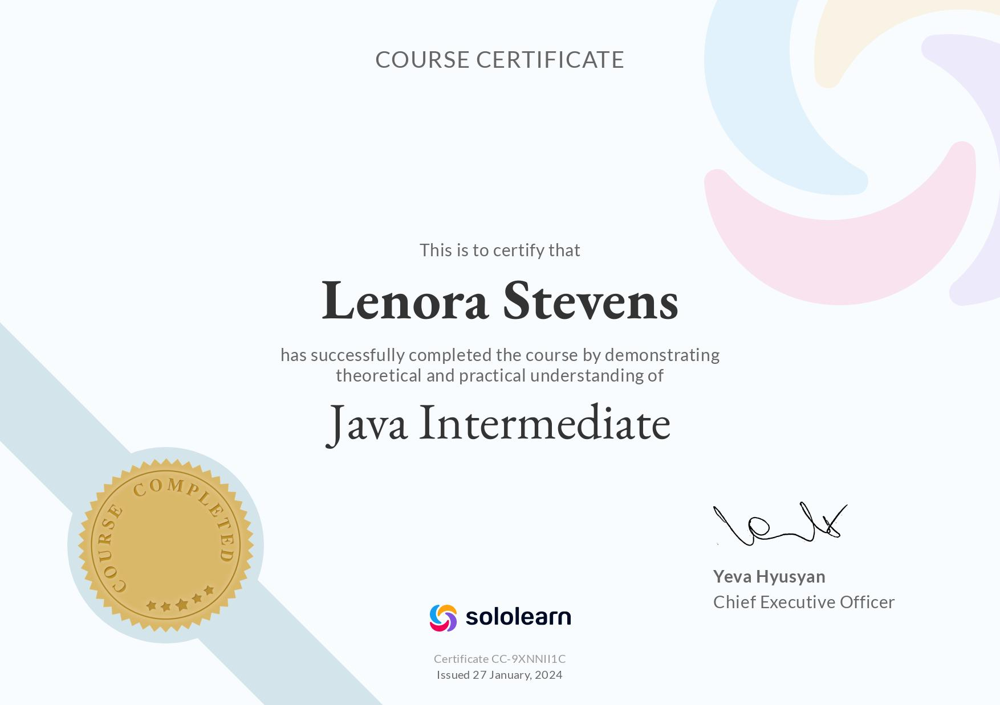

# Overview

I have begun a journey to learn to code in the Java language.  I have worked on SoloLearn to earn Java certificates and get a little practice with the concepts along the way.

My first Java program was a little ambitious.  This produces and GUI that takes a zipcode from the user and when Get Weather is clicked will display some basic current conditions.

My purpose for writing this software was to get experience with a GUI as well as learn how to work with API fetch outside of JavaScript. 

{Provide a link to your YouTube demonstration. It should be a 4-5 minute demo of the software running and a walkthrough of the code. Focus should be on sharing what you learned about the language syntax.}

[Software Demo Video](http://youtube.link.goes.here)

# Development Environment

- VS Code
- Java Development Kit
- JAR

# Useful Websites

- [SoloLearn](https://www.sololearn.com/en/learn/languages/java)
- [Visual Crossing Weather](https://www.visualcrossing.com/resources/documentation/weather-api/how-to-fetch-weather-forecast-data-from-a-restful-web-service-in-java/)
- [VS Code Java Start](https://code.visualstudio.com/docs/java/java-tutorial)
- [Java in one Video](https://youtu.be/drQK8ciCAjY?si=NfdhC4xgx9ZimBXj)
- [Create your First Java Frame](https://youtu.be/5G2XM1nlX5Q?si=psgBWfE3ErmHjQOM)
- [How to Call a REST API in Java](https://youtu.be/9oq7Y8n1t00?si=maXbeujzOHcxjuRI)
- [W3 Schools](https://www.w3schools.com/java/default.asp)

# Future Work

- Item 1 - Work on Displaying the Data more attractively
- Item 2 - Add relevant weather icons from the JSON data
- Item 3 - Add Forecast days and maybe even user choice of how many to view

# Certificates

